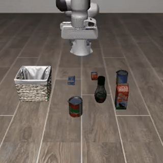
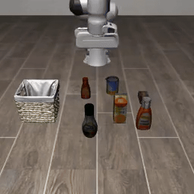
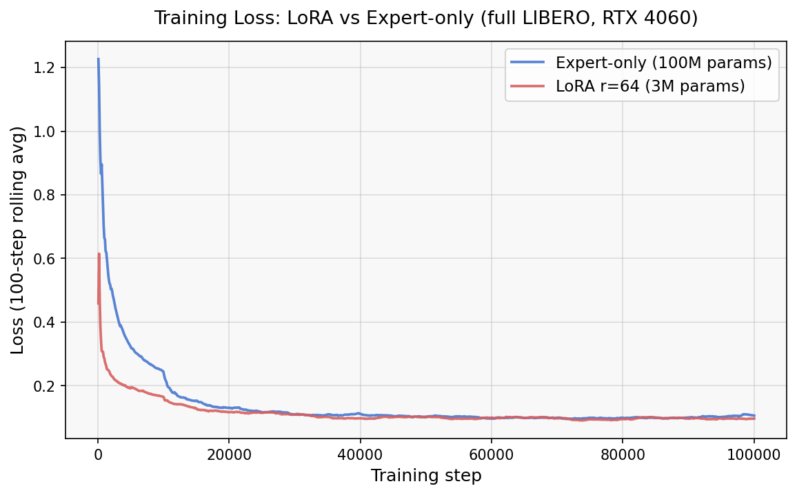
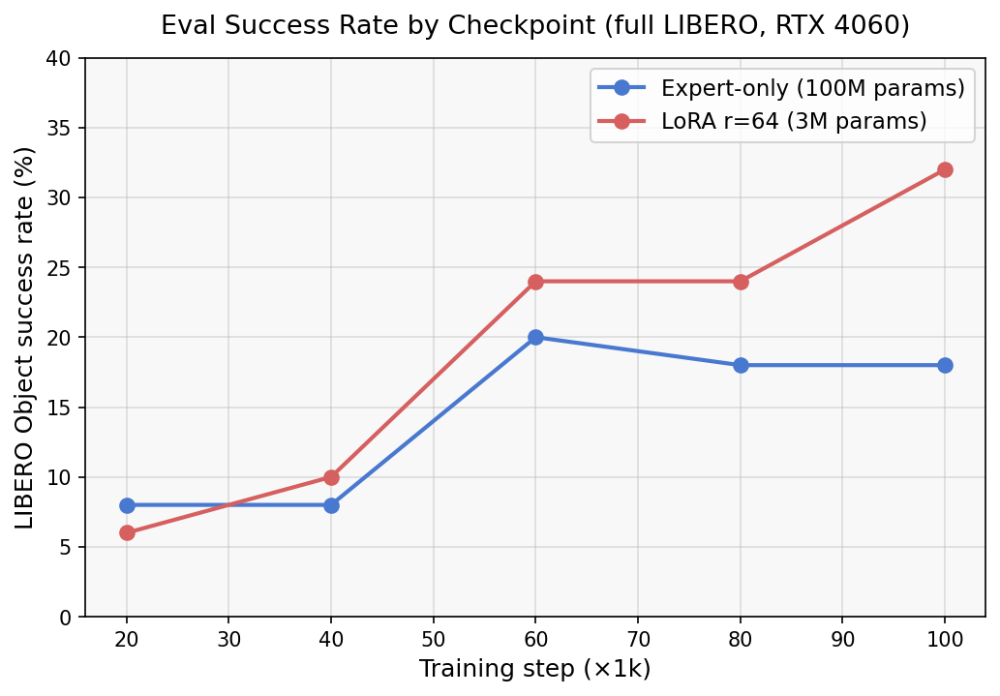
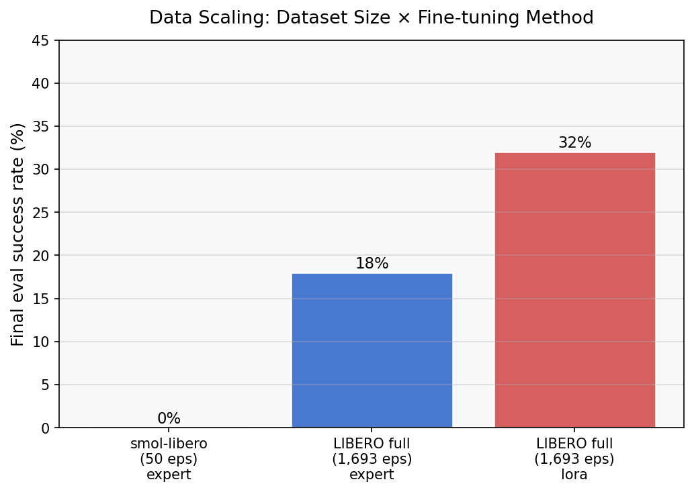

# SmolVLA: Vision-Language-Action Fine-Tuning on Consumer Hardware

End-to-end fine-tuning of a **450M-parameter Vision-Language-Action model** ([SmolVLA](https://huggingface.co/lerobot/smolvla_base)) for robotic pick-and-place on a single **RTX 4060 (8GB VRAM)** using [LeRobot](https://github.com/huggingface/lerobot).

<p align="center">
  
  &nbsp;&nbsp;&nbsp;
  
  <br/>
  <em>Left: 50-episode training → 0% success &nbsp;|&nbsp; Right: LoRA on full LIBERO (1,693 eps) → 32% success</em>
</p>

## Results

| Setup | Method | Trainable Params | Steps | LIBERO Object Success |
|-------|--------|-----------------|-------|----------------------|
| **SmolVLA paper** | Expert-only, batch 256, 4 GPU | 100M | 200k | 87.3% avg |
| **This project (LoRA)** | LoRA r=64, batch 2, RTX 4060 | 3M | 100k | **32%** |
| This project (expert-only) | Expert-only, batch 2, RTX 4060 | 100M | 100k | 20% |
| Subset (50 eps) | Expert-only, batch 2, RTX 4060 | 100M | 50k | 0% |

Operating at **1/128th the compute budget** (batch_size=2 vs 256, 1 GPU vs 4), LoRA fine-tuning reaches **32% task success** on LIBERO Object — outperforming full expert training (20%) with 33x fewer trainable parameters.

### Training Curves

<p align="center">
  
</p>

### Eval Success by Checkpoint

<p align="center">
  
</p>

| Steps | 20k | 40k | 60k | 80k | **100k** |
|-------|-----|-----|-----|-----|----------|
| LoRA r=64 (3M params) | 6 | 10 | 24 | 24 | **32** |
| Expert-only (100M params) | 8 | 8 | 20 | 18 | 18 |

### Data Scaling

<p align="center">
  
</p>

### Key Findings

**1. Data quantity dominates.** Training on 50 episodes (1 task) gave **0% eval success** despite 93% loss reduction. Switching to 1,693 episodes (40 tasks) immediately produced 20% success. In imitation learning, dataset scale matters more than training duration.

**2. LoRA outperforms full fine-tuning on consumer hardware.** With only 3M trainable params (vs 100M), LoRA r=64 with a 10x higher learning rate (1e-3 vs 1e-4) achieved 32% vs 20%. Fewer parameters + higher LR provides better regularization when effective batch size is small.

## Architecture

```
LIBERO Dataset (1,693 episodes, 40 tasks)
    │
    ▼
┌─────────────────────────────────────┐
│  SmolVLA (450M params)              │
│  ┌───────────────┐  ┌────────────┐  │
│  │ SmolVLM2-500M │  │  Action    │  │ ◄── 3M trainable params
│  │ (frozen)      │──│  Expert    │  │     (LoRA r=64 on q/v_proj)
│  │ Vision+Lang   │  │ (LoRA)    │  │
│  └───────────────┘  └────────────┘  │
│         ▲                  │        │
│    2x cameras         7-dim action  │
│    + state (8-dim)    (50-step      │
│    + task text         chunks)      │
└─────────────────────────────────────┘
    │
    ▼
MuJoCo LIBERO Simulation (eval rollouts)
```

- **Vision backbone**: SmolVLM2-500M-Video-Instruct (frozen)
- **Action expert**: Flow matching with 10-step denoising, 50-action chunking
- **Inputs**: 2 camera views (256x256), 8-dim proprioceptive state, task description
- **Outputs**: 7-dim actions (end-effector position, orientation, gripper)

## Setup

### Requirements

- Python 3.12+
- NVIDIA GPU with 8GB+ VRAM (tested on RTX 4060)
- ~40GB disk space (dataset + checkpoints)
- Linux (EGL rendering for headless MuJoCo)

### Installation

```bash
# Clone
git clone https://github.com/<your-username>/smolVLA.git
cd smolVLA

# Install dependencies
uv sync

# Create .env (required for HF cache and rendering)
cat > .env << 'EOF'
HF_HOME=/path/to/your/hf_cache
MUJOCO_GL=egl
EOF

# Install ffmpeg with libsvtav1 (required for video logging)
conda install -c conda-forge ffmpeg svt-av1
```

### Reproduce Best Result

```bash
# Export environment
set -a && source .env && set +a
export PATH=.local/bin:~/miniforge3/bin:$PATH
export LD_LIBRARY_PATH=~/miniforge3/lib:${LD_LIBRARY_PATH:-}

# Evaluate the best checkpoint (LoRA, 100k steps, 32% success)
uv run lerobot-eval \
  --policy.path=./experiments/libero_lora/checkpoints/100000/pretrained_model \
  --env.type=libero --env.task=libero_object \
  --eval.batch_size=1 --eval.n_episodes=50
```

### Train from Scratch

```bash
# Stop Ollama if running (frees ~5.3GB VRAM)
sudo systemctl stop ollama

# LoRA training — best result (100k steps, ~3.6 hours, 32% success)
uv run smolvla-train --config lora_r64

# Expert-only training (100k steps, ~3.5 hours, 20% success)
uv run smolvla-train --config expert_full
```

The launcher checks for Ollama automatically and errors before wasting training time. Available presets: `validation`, `smol_libero`, `expert_full`, `lora_r64`.

## Reproducibility Notes

Key gotchas discovered during development (several undocumented elsewhere):

1. **`set -a && source .env && set +a`** — plain `source .env` doesn't export to `uv run` child processes
2. **batch_size=2 max** on 8GB VRAM — batch_size=4 causes OOM during optimizer state initialization
3. **`--env.task=libero_10`** (all 40 tasks) OOMs on 8GB — use `libero_object` (10 tasks) for eval
4. **Output directory** must not pre-exist — LeRobot refuses to train if `output_dir` exists and `resume=False`
5. **50 episodes insufficient** — converges in loss but 0% eval success; need full dataset (1,693 episodes)
6. **Stop Ollama** before training — it silently consumes ~5.3GB VRAM
7. **cmake 4.x** requires a wrapper injecting `-DCMAKE_POLICY_VERSION_MINIMUM=3.5` for egl-probe
8. **EGL headers** needed from conda: `conda install -c conda-forge libegl-devel`

## Project Structure

```
smolVLA/
├── scripts/
│   ├── train_libero.sh              # Phase 2: validation (5k steps)
│   ├── train_libero_full.sh         # Phase 2: full smol-libero (50k steps)
│   ├── train_libero_full_dataset.sh # Phase 3: full LIBERO expert-only (100k steps)
│   └── train_libero_lora.sh         # Phase 4: LoRA r=64 (100k steps) ← best
├── experiments/ → nvmedisk2 (symlink)
│   ├── libero_full_dataset/         # Phase 3 checkpoints + eval videos
│   └── libero_full/                 # Phase 2 checkpoints
├── src/smolvla_manuf/
│   ├── analysis.py                  # WandB metric extraction + plot generation
│   ├── configs.py                   # Typed TrainingConfig dataclass + 4 presets
│   └── train.py                     # Training launcher with Ollama pre-flight check
├── tests/
│   ├── test_analysis.py             # 15 tests — WandB parsing, plots, export
│   └── test_configs.py              # 29 tests — config args, presets, launcher
├── assets/
│   ├── demo_success.gif             # Successful rollout (LoRA, 60k checkpoint)
│   ├── demo_failure_phase2.gif      # Phase 2 failure (0% with 50 episodes)
│   ├── loss_curves.png              # Training loss: LoRA vs Expert-only
│   ├── eval_progression.png         # Eval success rate by checkpoint
│   └── data_scaling.png             # Final eval by dataset size
├── results/
│   └── metrics.json                 # Structured training results (generated)
├── pyproject.toml
├── CLAUDE.md                        # Development notes + gotchas
└── README.md
```

## Limitations & Next Steps

- **32% vs 87.3%**: Primarily a batch size gap (2 vs 256). The model sees 128x fewer samples per gradient update, which limits generalization across the 10 LIBERO Object tasks.
- **Single eval suite**: Only evaluated on LIBERO Object (10 tasks). The full LIBERO benchmark has 4 suites (Spatial, Object, Goal, Long).
- **No gradient checkpointing**: SmolVLA in LeRobot v0.5.0 doesn't support `gradient_checkpointing`, preventing batch_size=4.

**Planned improvements:**
- Evaluation across all 4 LIBERO suites
- Per-task success breakdown
- Gradient checkpointing (requires patching `smolvlm_with_expert.py`) to enable batch_size=4

## References

- [SmolVLA: A Small Vision-Language-Action Model](https://arxiv.org/abs/2506.01844) (Zouitine et al., 2025)
- [LeRobot: State-of-the-art Machine Learning for Real-World Robotics](https://github.com/huggingface/lerobot)
- [LIBERO: Benchmarking Knowledge Transfer for Lifelong Robot Learning](https://github.com/Lifelong-Robot-Learning/LIBERO)
- [SmolVLA HuggingFace Blog](https://huggingface.co/blog/smolvla)

## License

MIT
